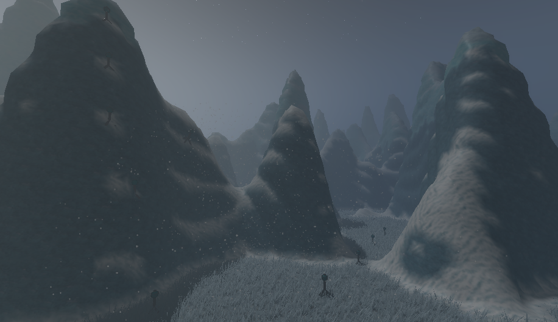
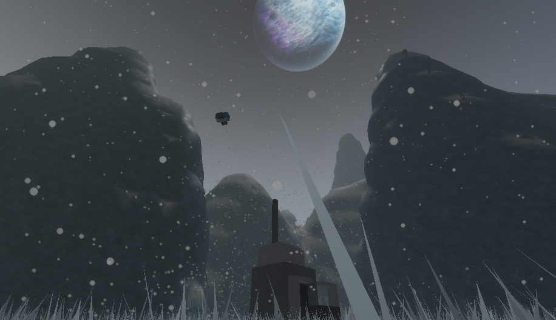
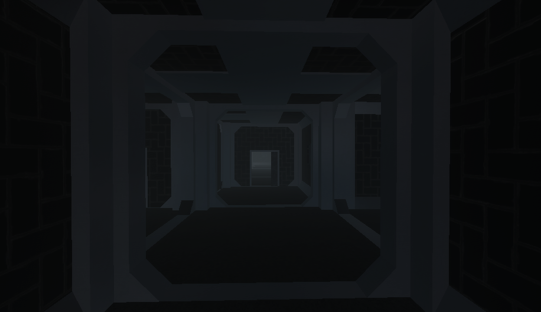
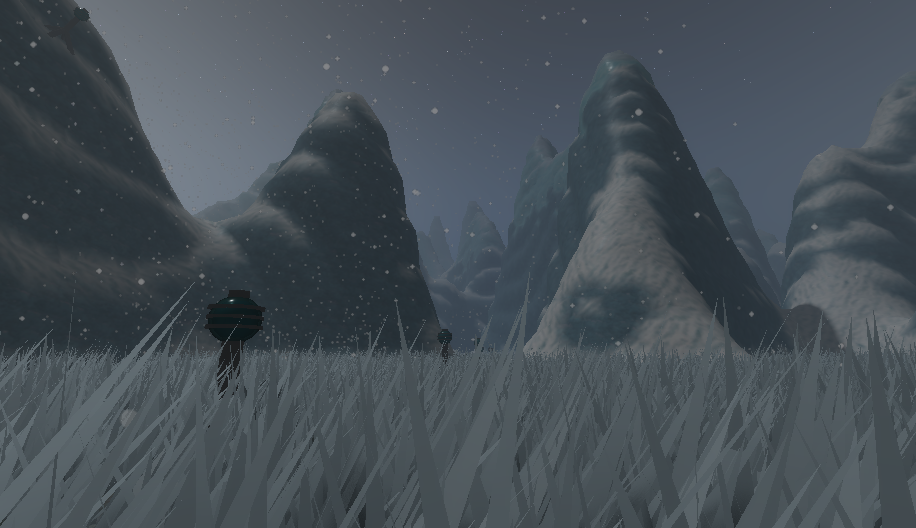

<!--
*** Thanks for checking out the Best-README-Template. If you have a suggestion
*** that would make this better, please fork the repo and create a pull request
*** or simply open an issue with the tag "enhancement".
*** Don't forget to give the project a star!
*** Thanks again! Now go create something AMAZING! :D
-->

<!-- PROJECT SHIELDS -->

<!--
*** I'm using markdown "reference style" links for readability.
*** Reference links are enclosed in brackets [ ] instead of parentheses ( ).
*** See the bottom of this document for the declaration of the reference variables
*** for contributors-url, forks-url, etc. This is an optional, concise syntax you may use.
*** https://www.markdownguide.org/basic-syntax/#reference-style-links
-->

[![Contributors][contributors-shield]][contributors-url]
[![Forks][forks-shield]][forks-url]
[![Stargazers][stars-shield]][stars-url]
[![Issues][issues-shield]][issues-url]
[![MIT License][license-shield]][license-url]
[![LinkedIn][linkedin-shield]][linkedin-url]

<!-- PROJECT LOGO -->

 

  

<h3 align="center">Cryogenia</h3>

    A wasteland survival with base building elements
     
    <a href="https://github.com/IsaacSShade/Cryogenia"><strong>Explore the docs »</strong></a>
     
     
    <a href="https://github.com/IsaacSShade/Cryogenia">View Demo</a>
    ·
    <a href="https://github.com/IsaacSShade/Cryogenia/issues">Report Bug</a>
    ·
    <a href="https://github.com/IsaacSShade/Cryogenia/issues">Request Feature</a>
  

<!-- TABLE OF CONTENTS -->

  
Table of Contents

  <ol>
    <li>
      <a href="#about-the-project">About The Project</a>
      <ul>
        <li><a href="#built-with">Built With</a></li>
      </ul>
    </li>
    <li><a href="#pictures">Pictures</a></li>
    <li><a href="#roadmap">Roadmap</a></li>
    <li><a href="#license">License</a></li>
    <li><a href="#acknowledgments">Acknowledgments</a></li>
  </ol>

<!-- ABOUT THE PROJECT -->

## About The Project

<!--

    
-->

A mix of gameplay similar to Lethal Company and Astroneer, Cryogenia pits a group of players on an isolated planet with no hope of rescue. 
They must figure out how to survive by utilizing the materials found in dangerous ancient ruins to escape or survive the incoming super-storm...

Features:

* Survival system with oxygen, power, and crafting
* Vast ruins filled with traps and treasure

(<a href="#top">back to top</a>)

### Built With

This section below contains the major frameworks/libraries used to create our project.

* Luau
* Roblox Studio
* Blender
* Rojo (for porting the project here)

(<a href="#top">back to top</a>)

<!-- USAGE EXAMPLES -->
## Pictures

A drone in action

    

The icy ruins

    

Ground Zero

    

(<a href="#top">back to top</a>)

<!-- ROADMAP -->

## Roadmap

- [X] Music
- [ ] Models and code for buildings
- [ ] Storm system
- [ ] Player UI
- [ ] Create classes for players to choose from

See the [open issues](https://github.com/othneildrew/Best-README-Template/issues) for a full list of proposed features (and known issues).

(<a href="#top">back to top</a>)

<!-- LICENSE -->

## License

Distributed under the MIT License. See `LICENSE.txt` for more information.

(<a href="#top">back to top</a>)

<!-- ACKNOWLEDGMENTS -->

## Acknowledgments

Contributors on this project:

* Aiden Tabrah
* Izzy
* Alex

(<a href="#top">back to top</a>)

<!-- MARKDOWN LINKS & IMAGES -->

<!-- https://www.markdownguide.org/basic-syntax/#reference-style-links -->

[contributors-shield]: https://img.shields.io/github/contributors/macbee280/byteland.svg?style=for-the-badge
[contributors-url]: https://github.com/macbee280/byteland/graphs/contributors
[forks-shield]: https://img.shields.io/github/forks/macbee280/byteland.svg?style=for-the-badge
[forks-url]: https://github.com/macbee280/byteland/network/members
[stars-shield]: https://img.shields.io/github/stars/macbee280/byteland.svg?style=for-the-badge
[stars-url]: https://github.com/macbee280/byteland/stargazers
[issues-shield]: https://img.shields.io/github/issues/macbee280/byteland.svg?style=for-the-badge
[issues-url]: https://github.com/macbee280/byteland/issues
[license-shield]:https://img.shields.io/github/license/macbee280/byteland.svg?style=for-the-badge
[license-url]: https://github.com/macbee280/byteland/blob/master/LICENSE.txt
[linkedin-shield]: https://img.shields.io/badge/-LinkedIn-black.svg?style=for-the-badge&logo=linkedin&colorB=555
[linkedin-url]: https://www.linkedin.com/in/gdimartino/
[product-screenshot]: images/screenshot.png
